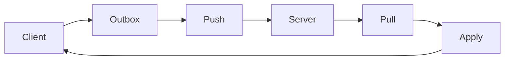

# Offline-First Sync Engine (Kotlin + SQLDelight)

A small, generic offline-first sync engine that demonstrates:
- **Outbox pattern** (local changes queued while offline)
- **Cursor-based pull** (efficient incremental sync)
- **Idempotent server change log** (safe retries)
- **Conflict strategy (LWW)** using `updatedAt`
- A runnable **demo-notes** module to show the full flow end-to-end

---

## Why this matters

Offline-first apps must handle:
- unreliable networks
- retries without duplication
- conflict resolution when multiple devices edit the same record
- fast incremental sync (no full reloads)

This repository provides a clear, modular reference implementation in Kotlin.

---

## Project structure

- `sync-core`
  - protocol & domain models (`Change`, `Op`)
  - `SyncEngine.syncOnce()`
  - `SyncReport`
  - `RemoteSync` interface (push/pull)
- `sync-sqldelight`
  - SQLDelight-backed implementations:
    - `SqlDelightOutbox`
    - `SqlDelightCursorStore`
- `demo-notes`
  - runnable JVM demo using SQLDelight + SQLite
  - a simulated server (`ServerSimulator`) with append-only change log + cursor tables

---

## Data model (core idea)

Each record is synced using:
- `id: UUID`
- `updatedAt: Instant`
- `deletedAt: Instant?` (tombstone)

Outgoing changes are queued in an **outbox** table:
- `PENDING` → `ACKED` or `FAILED`

Incoming changes are pulled using a monotonically increasing **cursor**:
- client asks: “give me changes after cursor X”
- server responds: changes + `nextCursor`

---

## Conflict strategy: Last Write Wins (LWW)

When applying a pulled change, the client checks:

- if `incoming.updatedAt >= local.updatedAt` → apply
- else → ignore (conflict)

This keeps the engine predictable and easy to reason about.
(Other strategies can be plugged in later.)

---

## Idempotent retries

The server change log is append-only, but retry-safe:
- `INSERT OR IGNORE`
- `UNIQUE(entity, record_id, updated_at)`

A re-sent batch won’t create duplicate server changes.

---

## Demo output

### No-op sync (already synced)
```txt
Cursor at start: 1
Pending outbox:
== SyncOnce ==
SYNC REPORT: SyncReport(entity=note, cursorBefore=1, pushed=0, acked=0, pulled=0, applied=0, ignored=0, cursorAfter=1)
Done.
Cursor at start: 1
== SyncOnce ==
Simulated remote server change: server-note-1
SYNC REPORT: SyncReport(entity=note, cursorBefore=1, pushed=0, acked=0, pulled=1, applied=1, ignored=0, cursorAfter=2)
Done.
```

## Run the demo

```bash
./gradlew :demo-notes:run --console=plain
```
## Sync Flow



## What I’d build next
- HTTP-based push/pull API
- per-entity cursors
- Android demo (Compose + SQLDelight)
- configurable conflict strategies
